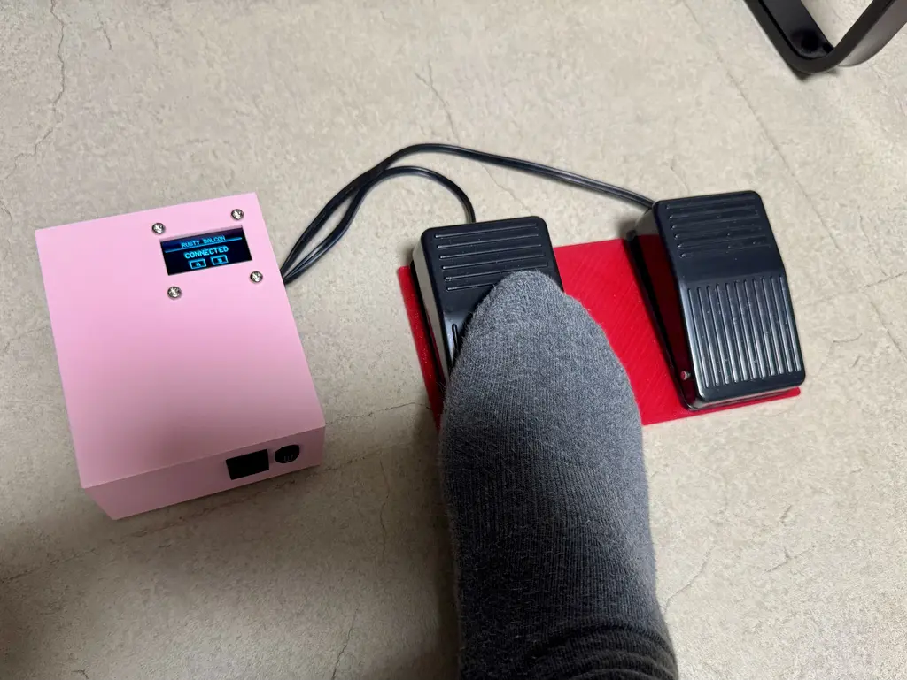
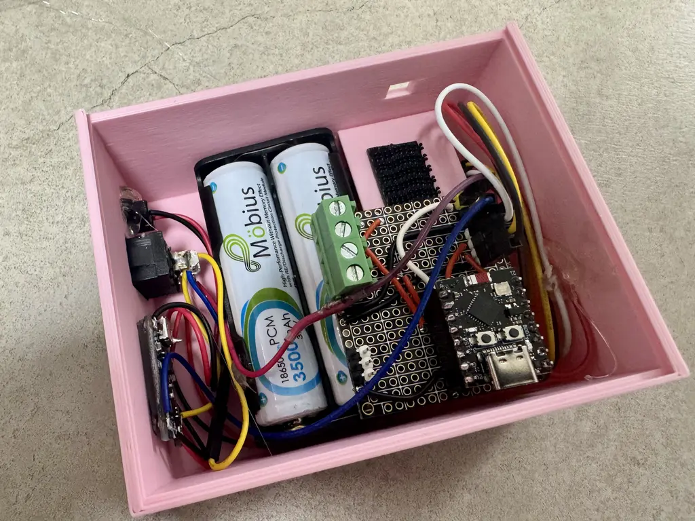

# Rusty Balcon


**Rusty Balcon** is a Rust-based firmware for an ESP32-C3 acting as a 2-key barebones Bluetooth (BLE) keyboard. It leverages the standard library (`std`) and `esp-idf-svc` for a robust development environment, implementing a HID Keyboard profile using the NimBLE stack via `esp32-nimble`.

## Hardware Build




## Hardware Configuration

- **Microcontroller**: ESP32-C3
- **Inputs**: 2 Push Buttons
  - Key 1: `GPIO1` (Internal Pull-Up) → ESC key
  - Key 2: `GPIO2` (Internal Pull-Up) → Voice Command (Consumer Control)
- **Display**: SH1106 128x64 OLED (I2C)
  - SDA: `GPIO8`
  - SCL: `GPIO9`

## Features

- **Bluetooth HID Keyboard**: Acts as a standard BLE keyboard using the NimBLE stack. Identifies as an Apple Magic Keyboard mock for best compatibility with macOS/iOS.
- **OLED Status Display**: Shows current device state on a 128x64 OLED screen with key press visualization.
- **Power Management**:
  - Display blanks after **30 seconds** of inactivity.
  - Enters Deep Sleep after **5 minutes** of inactivity to conserve battery. Wakes on button press (GPIO1 or GPIO2).
- **Wakeup Key Replay**: The button press that wakes the device from deep sleep is remembered and automatically replayed 500ms after BLE reconnects, so the keypress is never lost.
- **Pairing Mode**: Hold both keys simultaneously for 5 seconds to clear all bonds and enter pairing mode.

## Device States

| Display Text      | Meaning                                              |
|-------------------|------------------------------------------------------|
| `IDLE`            | Not connected, advertising                           |
| `RECONNECTING...` | Woke from deep sleep, waiting for BLE to reconnect   |
| `>> PAIRING <<`   | Pairing mode active (blinking)                       |
| `CONNECTED`       | Connected to a host                                  |

## Prerequisites

- [Rust Toolchain](https://rustup.rs/) (1.88+)
- [espup](https://github.com/esp-rs/espup) for ESP-RS toolchain setup
- [ldproxy](https://github.com/esp-rs/ldproxy) for linking
- `espflash` for flashing: `cargo install espflash`

## Build and Run

1. **Environment Setup**: Ensure your ESP-IDF environment is sourced (e.g., `. $HOME/export-esp.sh`).
2. **Build**:
   ```bash
   cargo build --release
   ```
3. **Flash and Run**:
   ```bash
   cargo run --release
   ```

## License

This project is open-source and available under the MIT License.
