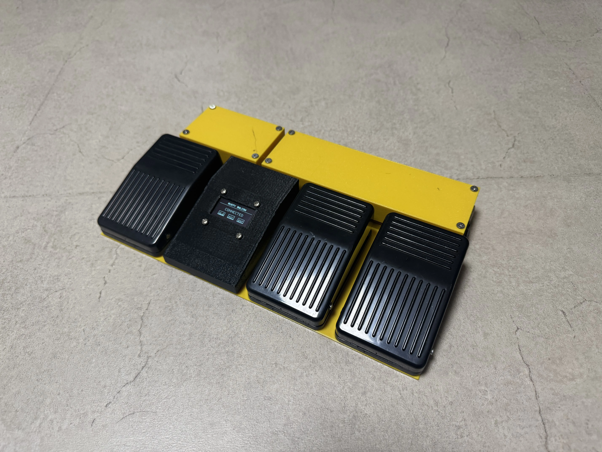
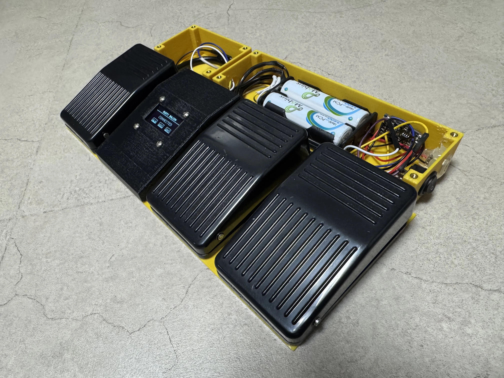
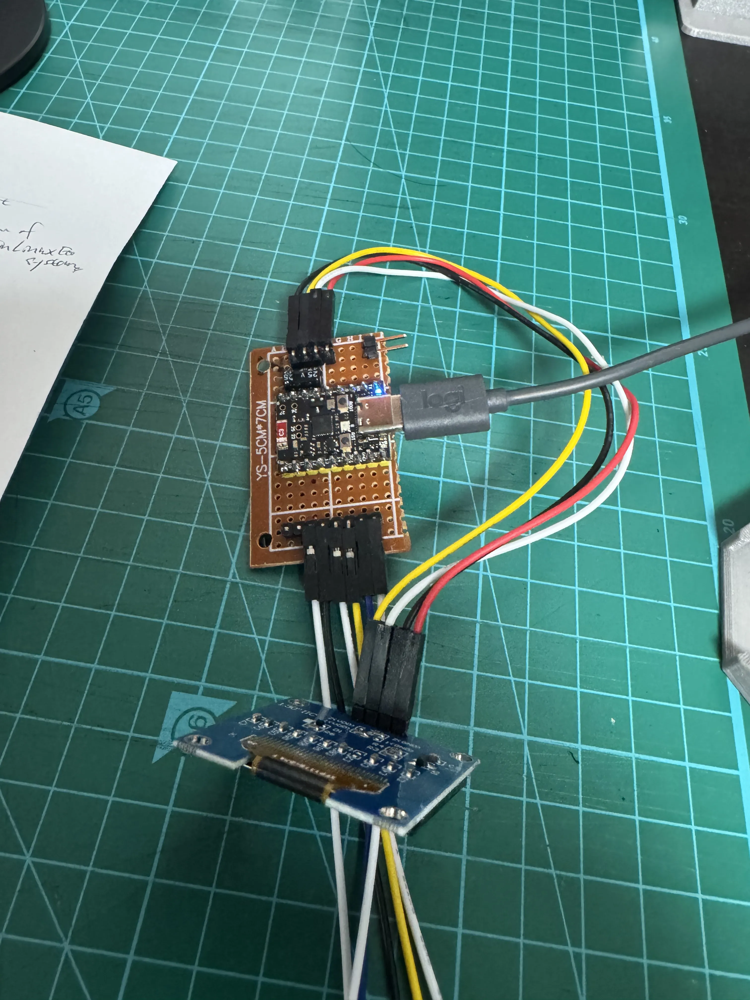
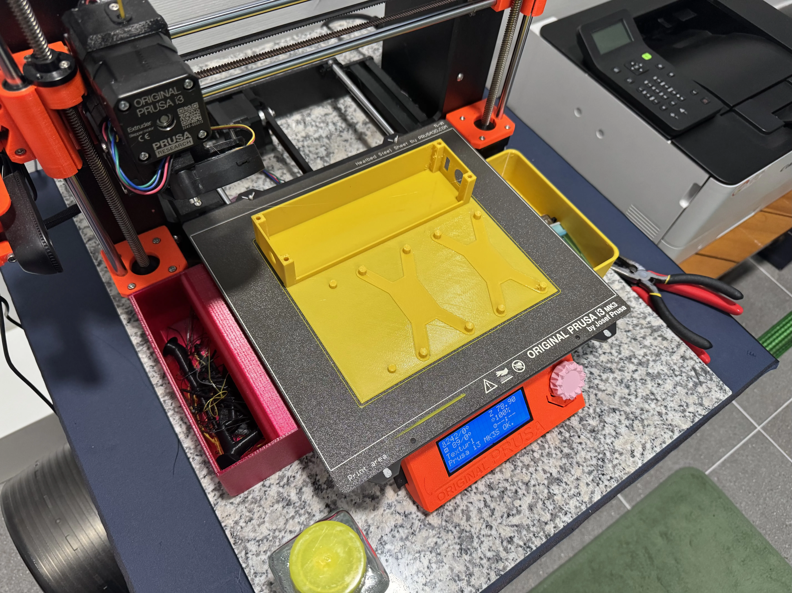

# Rusty Balcon



**Rusty Balcon** is a Rust-based firmware for an ESP32-H2 acting as a 3-key barebones Bluetooth (BLE) keyboard. It leverages the standard library (`std`) and `esp-idf-svc` for a robust development environment, implementing a HID Keyboard profile using the NimBLE stack via `esp32-nimble`.

## Hardware Build





## Hardware Configuration

- **Microcontroller**: ESP32-H2
  - Module reference: [esp32-h2-supermini-kicad](https://github.com/Zektopic/esp32-h2-supermini-kicad)
- **Inputs**: 3 Push Buttons (RTC GPIOs 7–14 required for deep-sleep EXT1 wakeup)
  - Key 1: `GPIO13` (Internal Pull-Up) → Globe 🌐 (Consumer AC Keyboard Layout Select)
  - Key 2: `GPIO11` (Internal Pull-Up) → Voice Command (Consumer Control) or Escape (ESC) Key (Toggleable)
  - Key 3: `GPIO12` (Internal Pull-Up) → Enter key
- **Display**: SH1106 128x64 OLED (I2C)
  - SDA: `GPIO4`
  - SCL: `GPIO5`

## Features

- **Bluetooth HID Keyboard**: Acts as a standard BLE keyboard using the NimBLE stack. Identifies as an Apple Magic Keyboard mock for best compatibility with macOS/iOS.
- **OLED Status Display**: Shows current device state on a 128x64 OLED screen with real-time key press visualization and dynamic Key 2 label (`MIC` / `ESC`).
- **Key 2 Mode Switching (Voice ↔ ESC)**: Hold **Key 1 (Globe) + Key 2** simultaneously for 5 seconds to toggle Key 2 function between **Voice Command (`MIC`)** and **Escape key (`ESC`)**. The selected mode is persisted to NVS (Non-Volatile Storage) across reboots and deep sleep.
- **Power Management**:
  - Display blanks after **30 seconds** of inactivity.
  - While **Connected**, stays awake (display off only) so keys remain instantly responsive.
  - Enters Deep Sleep after **30 minutes** of inactivity **only when Idle** (disconnected). Wakes on button press (GPIO13, GPIO11, or GPIO12 via EXT1).
- **Wakeup Key Replay**: The button press that wakes the device from deep sleep is remembered and automatically replayed 500ms after BLE reconnects (respecting the current Key 2 mode), so the keypress is never lost.
- **Pairing Mode**: Hold **Globe + Enter** simultaneously for 5 seconds to clear all bonds and enter pairing mode. OLED shows `>> PAIRING <<` while advertising for a new host.

## Device States

| Display Text      | Meaning                                              |
|-------------------|------------------------------------------------------|
| `IDLE`            | Not connected, advertising                           |
| `RECONNECTING...` | Woke from deep sleep, waiting for BLE to reconnect   |
| `>> PAIRING <<`   | Pairing mode active (blinking)                       |
| `CONNECTED`       | Connected to a host                                  |
| `MODE: VOICE`     | Key 2 set to Voice Command (MIC)                     |
| `MODE: ESC`       | Key 2 set to Escape (ESC) key                        |

## Prerequisites

- [Rust Toolchain](https://rustup.rs/) (1.88+)
- [espup](https://github.com/esp-rs/espup) for ESP-RS toolchain setup
- [ldproxy](https://github.com/esp-rs/ldproxy) for linking
- `espflash` for flashing: `cargo install espflash`

## Build and Run

1. **Environment Setup**: Ensure your ESP-IDF environment is sourced (e.g., `. $HOME/export-esp.sh`).
2. **Build**:
   ```bash
   cargo build --release
   ```
3. **Flash and Run**:
   ```bash
   cargo run --release
   ```

## License

This project is open-source and available under the MIT License.
